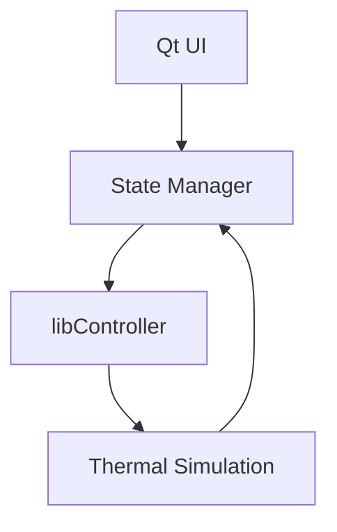
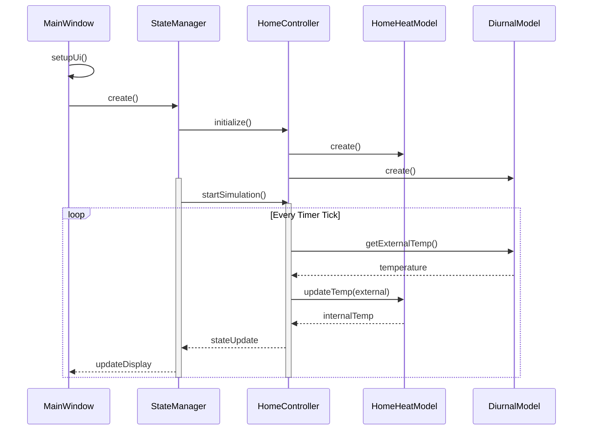

# State Controller Design Document

## Overview
This application simulates thermal control of a simple building using the libController library and Qt framework. It provides a single-window interface for monitoring and controlling building temperature states.

## Components

### User Interface
- Single Qt window implementation
- Real-time temperature display
- Control input widgets
- Status indicators

### Controller Integration
- libController integration for thermal simulation
- State management system
- Temperature control algorithms

## Architecture

## State Machine
The state machine diagram illustrates the interaction control flow and state transitions between different user-system interactions.

This diagram shows:
- Transition states between different user actions
- Control flow of the system interaction
- Event triggers and state changes
- Entry and exit conditions for each state

## Models
This application uses two models to simulate heating and cooling of the interior of a structure given outside temperature
- the class HomeHeatModel simulates the effect of HVAC plan output on interior temperature

- the class DiurnalSurfaceTemperatureModel simulates the exterior surface air termperature as a function of time of day, latitude and day of year
Source: Hietaharju, P.; Ruusunen, M.; Leiviskä, K. A Dynamic Model for Indoor Temperature Prediction in Buildings. Energies 2018, 11, 1477. https://doi.org/10.3390/en11061477

## User Interface

The interface layout shows the main components and their arrangement within the application window. Temperature controls and status indicators are positioned for optimal user interaction.

## Key Features
- Real-time temperature monitoring
- Manual control overrides
- Automated temperature regulation
- State persistence
- Error handling and alerts

## Sequence Diagram
